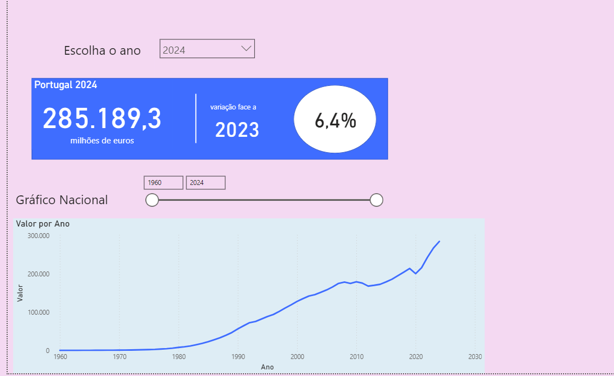
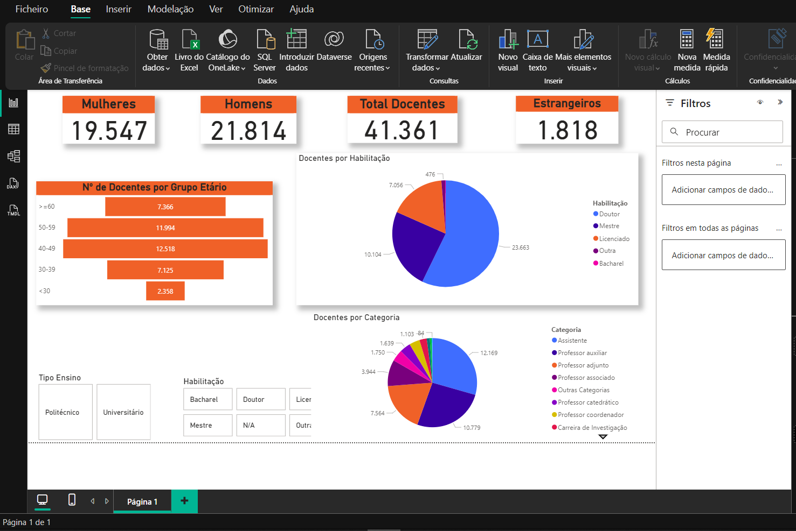

# Power BI Projects

📊 Este repositório reúne dashboards desenvolvidos em **Power BI** como parte do meu portfólio de Data Analytics.  
Cada projeto utiliza dados **públicos** e está documentado com ficheiros, PDFs e screenshots.

---

## 🔹 Projetos incluídos

### 1. [Perfil do Docente do Ensino Superior (2023/2024)](perfil-docente-ensino-superior-pt)

**Descrição:**  
Dashboard inspirado no relatório interativo da **DGEEC** 👉[Link direto](https://app.powerbi.com/view?r=eyJrIjoiOTdhNzI3YjctYTM1ZC00NjUyLThkZGYtMjdjNDUzZTA3NjllIiwidCI6ImQ0MWIzMGNmLTgzMzEtNGJkNC05YTJkLTg3NGY1MmIwMDQxNSIsImMiOjh9) que analisa o perfil dos docentes do Ensino Superior em Portugal.  
Inclui indicadores como: número total de docentes, distribuição por sexo, idade, habilitação académica, tipo de instituição (pública/privada) e ensino (politécnico/universitário).  

**Dados:**  
- Fonte: **DGEEC – Direção-Geral de Estatísticas da Educação e Ciência**  
- Foi disponibilizado um ficheiro Excel com os dados de 2023/2024.  
- Esse ficheiro foi **adaptado para um modelo em Excel de dimensões e factos** (`ExcelDimensõesFactos.xlsx`), facilitando assim o tratamento e a modelação no Power BI.  

**Ficheiros disponíveis:**  
- `PerfilDocente.pbix` – Dashboard interativo no Power BI  
- `PerfilDocente.pdf` – Versão estática em PDF  
- `/data` – ficheiros Excel originais e adaptados  
- `dashboard.png` – Screenshot principal  

---

### 2. [Evolução do PIB em Portugal (1960 – 2024)](pib-portugal-1960-2024)

**Descrição:**  
Dashboard construído em Power BI para analisar a evolução do **Produto Interno Bruto (PIB) de Portugal** entre 1960 e 2024.  
Inclui análise de valores anuais, variação face ao ano anterior e gráfico histórico da evolução do PIB.  

**Dados:**  
- Fonte: **PORDATA**  
  👉 [Link direto](https://www.pordata.pt/pt/estatisticas/economia/crescimento-e-produtividade/produto-interno-bruto-pib)  
- Dados exportados em CSV e tratados no Power BI.  

**Ficheiros disponíveis:**  
- `dashboard.pbix` – Dashboard interativo no Power BI  
- `dashboard.pdf` – Versão estática em PDF  
- `/screenshots` – Imagem do relatório  

---

---

## 🛠️ Tecnologias utilizadas
- **Power BI Desktop** (modelação de dados e design de relatórios)  
- **Excel** (preparação de dados em dimensões e factos)  

